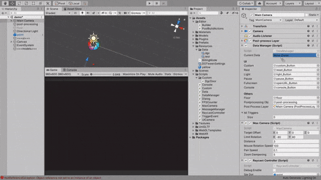
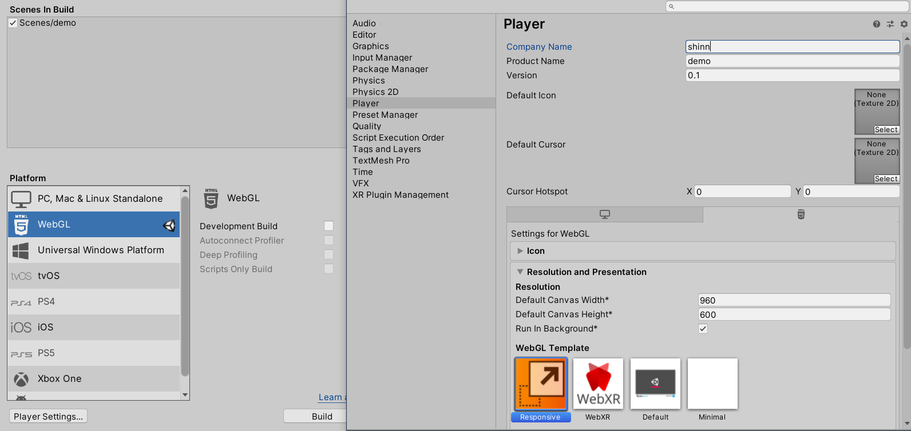

# UWebGL_ModelViewer
  
  

DEMO    
https://shinn716.github.io/Test/

Unity WebGL - Model Viewer  
Worked fine in Unity 2019.4.26f1.  
Platform: WebGL
  
Responsive-webgl-template bug fix from  
https://gist.github.com/shinn716/519cbc79b2b6a5847b855ea43188d036.
  
Model from  
[TR-66 Rhythm Arranger](https://sketchfab.com/3d-models/tr-66-rhythm-arranger-b58a105480dc4785ad39a3155476f7ec)
    
## Feature
1. Include standalone/mobile controller(rotation/pan/zoom).
2. With dialog module.
3. With object-trigger event module.
4. Load model and config from custom ScriptableObject.
5. With responsive template.
6. Support GLTF.
7. Ignore webgl-warning for mobile.

## Control (Like sketchfab)  
1. Tab and move: rotation camera .
2. Pinch: Zoom in/out.
3. Pan: three-finger drag.  
  
## Support  
https://caniuse.com/webgl2  
  
## Package  
1. [Responsive-webgl-template](https://assetstore.unity.com/packages/tools/gui/responsive-webgl-template-117308)
5. [DOTween](https://assetstore.unity.com/packages/tools/animation/dotween-hotween-v2-27676)
3. [UniGLTF](https://github.com/ousttrue/UniGLTF)
4. [WebXR](https://github.com/Rufus31415/Simple-WebXR-Unity) (Not test yet) 
5. Post-processing 3 (From package manager)

## License
[MIT](https://github.com/shinn716/UWebGL_ModelViewer/blob/main/LICENSE)
